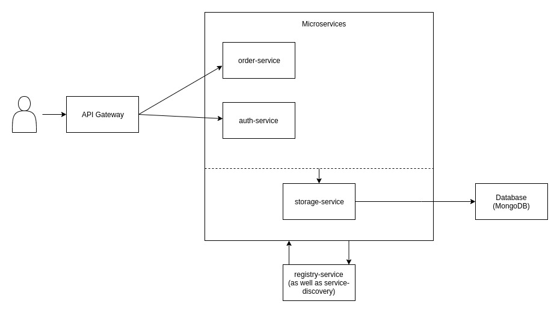

# Mircoservice POC


[](https://opensource.org/licenses/MIT)

This is prove of concept for microservice, which is mostly written in NodeJS.

It provides basic overview about: 
- How to design microservice architecture
- What do you need to concern in implementing mircoservice architecture and the way to combat them, such as user authentication, service discovery, monitoring, logging
- How does service communicate within microservice system
- The list go on

**_Note: Do not use this POC in production mode_**

## Architecture



### Services

- **Registry Service**: manage service state, execute registering/unregistering service.
- **Storage Service**: support manipulating record in database by exposing API for other services in the system can consume. The systems use 1 database for storing.
- **Authentication Service**: manage user (create/update/delete) and do authentication
- **Order Service**: process orders.
- **Monitoring**: monitor CPU, memory, network and more for each service
- **Logging**: centralized logging for application with ELK stack

## Prerequisites

- [Docker](https://docs.docker.com/install/)
- [docker-compose](https://docs.docker.com/compose/install/)
- [NodeJs v10](https://nodejs.org/dist/latest-v10.x/)
- Available port: 80,443, 5601, 3000

## Getting Started

```bash
docker-compose up
```

After docker-compose is up, you can access the following components:

- Monitoring(Grafana): http://localhost:3000 (Credential: admin/admin)
- Centralized logging (Kibana): http://localhost:5601 (Credential: elastic/admin)
- Open API: http://localhost (Postman collection and environment is located at `./tests`)

## Testing

To test, run the following command

1. Install dependencies
```bash
# with npm
npm install
# or with yarn
yarn
```
2. Run test
```bash
./scripts/test
```

## Teardown

```bash
docker-compose down
```