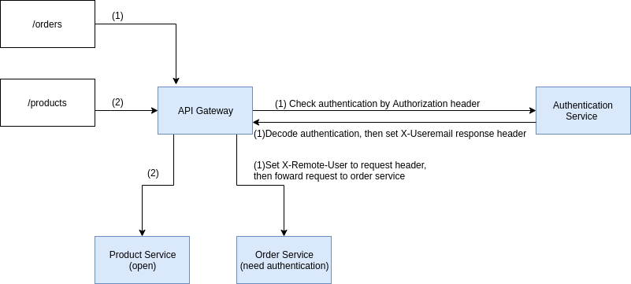

# API Gateway for Microservice

## Getting Started

API Gateway, act as a proxy server to route/direct the user request to appropriate service.

In addition, this API also handle end user authentication

### Architecture

### Tools

Behind the scene, this API Gateway use Nginx to implement system